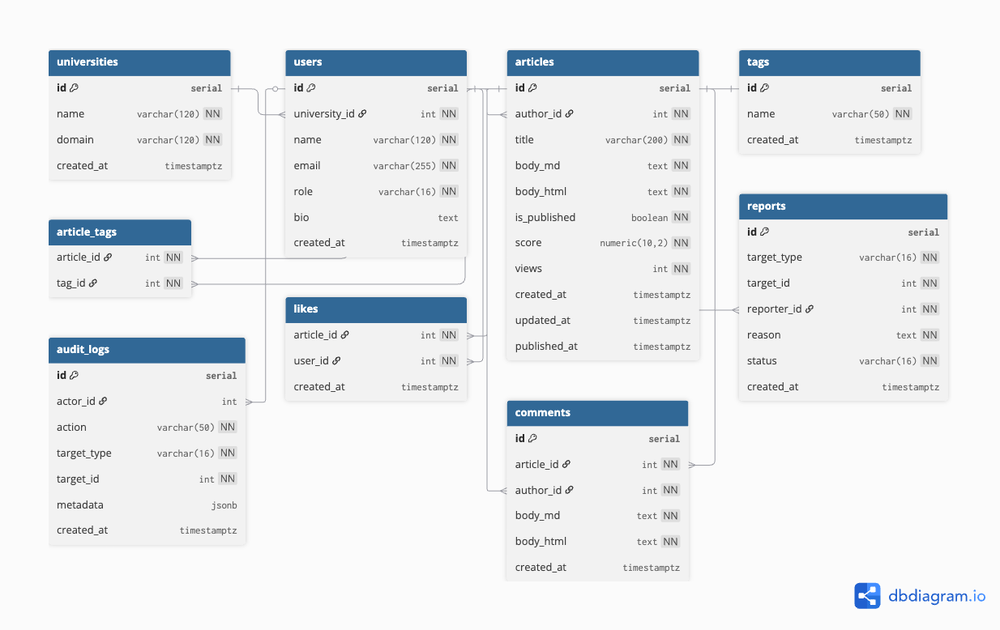

# 📚 Campus Qiita Backend

FastAPI + SQLAlchemy を用いたバックエンド API サーバです。  
記事投稿、タグ付け、コメント、いいねなど、掲示板の基本機能を提供します。

---

## 🚀 技術スタック

- **言語**: Python 3.11
- **フレームワーク**: FastAPI
- **DB**: PostgreSQL（Neon）
- **認証**: Firebase Authentication + Cookie セッション
- **ORM / Migration**: SQLAlchemy + Alembic
- **デプロイ**: Railway (API) + Neon (DB)
- **環境構築**: docker


---

## 🎯 作った理由

2025年8月に参加したインターンで、初めてバックエンド開発に触れました。  
そこで Git 運用、DB 設計、マイグレーション、レビューの流れなどを体験し、  
「もっと理解を深めたい」「自分でも動かせるものを作りたい」と思い、このバックエンド開発に挑戦しました。  

このバックエンドはフロントエンドとあわせて **約10日間で構築** しており、以下を意識しました：

- ER 図を自分で設計し、Alembic を使ったマイグレーションを経験  
- FastAPI + SQLAlchemy を用いた REST API 開発  
- Firebase 認証を組み込み、Cookie ベースのセッション管理を実装  
- Railway（API）+ Neon（DB）にデプロイし、実際に稼働する環境を構築  

今は記事投稿・コメント・タグ付け・いいねなど、  
**掲示板に必要な最低限の機能を持った API サーバ** ですが、  
将来的には以下のように拡張を想定しています：

- 管理者（例: 自分のアカウント）による投稿やユーザーの管理機能  
- 検索やランキング機能の強化（trigram index を活用）  
- 大学ごとのスコープ分け（特定大学内でのナレッジ共有）

この開発を通して、**クラウド環境にデプロイして「実際に動く」バックエンドを公開する経験** ができました。  
単なるローカル検証にとどまらず、本番環境を意識して設計した最初のプロジェクトです。

---

## 📂 ディレクトリ構成
```
campus-qiita-backend/
├── app/
│   ├── main.py          # FastAPI エントリーポイント
│   ├── routers/         # 各 API ルート（auth, articles, tags, admin）
│   ├── core/            # Firebase 初期化など
│   ├── schemas/         # Pydantic スキーマ
│   ├── dependencies.py  # 認証などの依存関係
│   └── database.py      # DB 接続設定
├── migrations/          # Alembic マイグレーション
├── requirements.txt
└── README.md
```
## ER図


## ⚙️ 環境変数

以下の環境変数を設定してください（Railway などに登録）。

```env
# ========================
# Local 開発用
# ========================
DATABASE_URL=postgresql+psycopg2://postgres:postgres@db:5432/uni_qiita
FRONTEND_BASE=http://localhost:3000
SESSION_COOKIE_NAME=session

# Firebase (Admin SDK)
FIREBASE_PROJECT_ID=uniqiiita-dev
FIREBASE_CREDENTIALS_FILE=./secrets/firebase-adminsdk.json

# ========================
# 本番環境 (Railway + Neon)
# ========================
# Railway / Vercel の環境変数ダッシュボードに設定
# DATABASE_URL=postgresql+psycopg2://<user>:<password>@<neon-host>/<dbname>?sslmode=require
# CORS_ALLOW_ORIGINS=https://<your-vercel-app>.vercel.app
```
---

## 🛠️ ローカルでの起動

```bash
docker compose up --build
docker compose exec backend alembic upgrade head

#swaggerはdockerを起動させると自動で立ち上がります。
```
---
## 🌐 本番デプロイ
	•	Backend → Railway
	•	Database → Neon (PostgreSQL)
	•	Frontend → Vercel
---
## 🔑 認証
	•	Firebase Authentication を使用
	•	/auth/firebase-login にフロントから ID Token を送信
	•	サーバー側で検証し、セッションCookieを発行
	•	以降は Cookie 認証で API を利用可能
---
## 📡 主なエンドポイント
	•	POST /auth/firebase-login : Firebase ログイン
	•	GET /auth/me : 現在のログインユーザー
	•	GET /v1/articles/ : 記事一覧
	•	POST /v1/articles/ : 記事作成
	•	PATCH /v1/articles/{id} : 記事更新
	•	DELETE /v1/articles/{id} : 記事削除
	•	GET /v1/tags/ : タグ一覧
	•	POST /v1/tags/ : タグ作成

---

## 個人的なメモ

Readmeの書き方
https://qiita.com/shun198/items/c983c713452c041ef787
jetとは　https://qiita.com/arara4510/items/55fc005f8f676f40afcb

大学版キータ(FastAPI)の開発

dockerの起動方法
- こdocker compose up -dれで起動
-docker compose config 構文ミスがないかバリデーション　　configuration(設定) validation(検証)
-docker compose ps 状態確認
-docker compose ps コンテナがちゃんと立ち上がっているのかを一覧で確認
-docker logs -f uniqiita-db　コンテナ内部のログ出力をみるためのもの
-docker exec -it uniqiita-db psql -U postgres -d uni_qiita -c "SELECT version();"　「DBがPostgresの何バージョンで動いてるか」を確認
-docker exec -it uniqiita-db psql -U postgres -d uni_qiita -c "SELECT 1;"  DBが正しく動いてSQLを返せるか」

dockerデスクトップのexecではpsql -U postgres -d uni_qiita　と打つとそこでsqlのコマンドを打てる
`メモ`
docker exec -it uniqiita-db psql -U postgres -d uni_qiita -c "..."
   

docker logs --tail 50 uniqiita-backend　これエラーを確認できる


docker exec
→ すでに起動しているコンテナの中でコマンドを実行する。

-it
→ -i = 標準入力を有効にする (interactive)。
-t = 疑似端末(TTY)を割り当てる。
両方合わせると「コンテナ内で対話的にコマンドが打てる状態」になる。

uniqiita-db
→ コマンドを実行する対象のコンテナ名（docker-compose.ymlで指定した container_name）。

psql
→ Postgresのクライアント。SQLを実行するためのコマンドラインツール。

-U postgres
→ 接続ユーザー名。ここではユーザーpostgresとしてログイン。

-d uni_qiita
→ 接続するデータベース名。ここでは uni_qiita に接続。

-c "..."
→ -c オプションは「SQL文を1回だけ実行して終了する」という意味。
"..." の中に書いたSQLをそのまま投げる。

dbdiagramからGitHubに載せる最短手順

dbdiagramで Export → DBML（erd.dbml）

Export → PNG/SVG（erd.png or erd.svg）

リポジトリに /docs/db/ フォルダを作って両方配置

README.md に画像を貼る（差分が見やすい）

## ERD

SELECT <取り出したいカラム>
FROM <どのテーブルから>
WHERE <条件>
ORDER BY <並び順>
LIMIT <何件取るか>;


postgresql+psycopg://postgres:postgres@db:5432/uni_qiita
これは PostgreSQL に接続するための URL（接続文字列）です。アプリ（FastAPI + SQLAlchemy）が DB に繋ぐときに使ってるやつ。
	postgresql+psycopg
→ DBの種類とドライバ
	•	postgresql = PostgreSQL を使う
	•	+psycopg = Python 用のドライバ（psycopg3）を経由する
	•	postgres:postgres
→ ユーザー名:パスワード
	•	ユーザー: postgres
	•	パスワード: postgres
	•	@db:5432
→ ホスト名とポート
	•	ホスト: db （docker-compose 内でDBコンテナに付けたサービス名）
	•	ポート: 5432（Postgresのデフォルトポート）
	•	/uni_qiita
→ 接続するデータベース
	•	今回は uni_qiita というDBを使う

 "insert into article_tags (article_id, tag_id) values (2, 1) on conflict do nothing;"

git reset --hard origin/main でlocalをリモートの状態にする
git clean -fd　とすることで余分なフォルダを消す
---